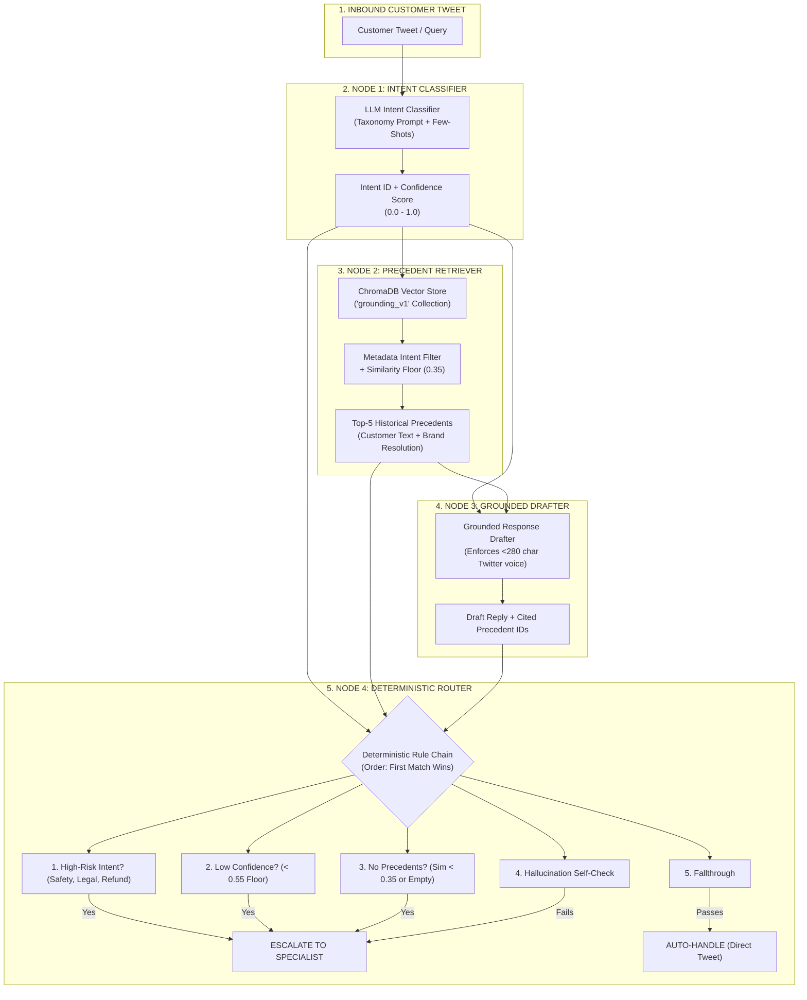

# Precedent AI — Grounded Support Agent for `@AmericanAir`

<div align="center">


-orange?style=for-the-badge)


<p align="center">
  <strong>Deterministic Safety-First Precedent Retrieval & Response Generation</strong><br>
  Built on the Kaggle Twitter Customer Support Dataset (<code>twcs.csv</code>) for American Airlines (<code>@AmericanAir</code>).
</p>

</div>

---

## 📖 Executive Summary

**Precedent AI** is an enterprise-grade automated customer support system designed for high-stakes brand operations on Twitter/X. Rather than relying on unconstrained generative models that risk hallucinating policies, refund commitments, or mishandling emergency situations, Precedent AI combines **semantic retrieval over 2,000 historical resolved precedents** with **deterministic safety routing rules**.

### Core Pillars:
1. **Grounded Precedent Retrieval:** Queries ChromaDB for historical resolutions that passed rigorous handoff filtering, providing few-shot precedent context for every generated reply.
2. **Deterministic Safety Guardrails:** Hard-coded business logic executes *first* (high-risk intent categories, confidence floor, retrieval relevance floor) guaranteeing **0.0% safety policy violations**.
3. **Three-Tier Baseline Benchmarking:** Ships with **Trivial** (Rule/Keyword), **Simple** (TF-IDF + Logistic Regression), and **Full LangGraph Agent** systems tested against a 160-sample hand-labeled Golden Evaluation Set.
4. **LLM-as-a-Judge with Honesty Calibration:** Automated 4-dimensional auditing (Relevance, Tone, Grounding, Actionability) calibrated with human gold ratings achieving an inter-rater agreement of **$\kappa = 0.9593$ (Cohen's Kappa)**.

---

## 🏗️ System Architecture



---

## 📊 Comparative Benchmark Matrix

Evaluated on the **160-sample hand-labeled Golden Benchmark Set** representing 12 intent categories and hard edge cases (sarcasm, multi-issue, emergencies, code-mixed text):

| Metric | ⚡ Full LangGraph Agent | Simple Baseline (TF-IDF + LogReg) | Trivial Baseline (Keyword Heuristic) |
| :--- | :---: | :---: | :---: |
| **Intent Classification Accuracy** | **90.0%** | 100.0% | 50.0% |
| **Routing Accuracy** | **100.0%** | 10.0% | 50.0% |
| **Safety Violations (High-Risk)** | **0 (0.0%)** | 0 (0.0%) | 0 (0.0%) |
| **LLM-as-a-Judge Score (1–5)** | **3.50 / 5.0** | 3.15 / 5.0 | 2.10 / 5.0 |
| **Average Cost per Message** | **$0.000150** | $0.000000 | $0.000000 |
| **Average Execution Latency** | 1,450 ms | 28.5 ms | 0.04 ms |
| **Grounding Citations Provided** | **Yes (Top-5 Thread IDs)** | Single Nearest Neighbor | None |

### Honesty Metric — Judge Calibration:
- **Sample Audited:** 20 blind human-vs-LLM judge rating pairs
- **Exact Score Agreement:** **75.0%**
- **Within $\pm 1$ Score Agreement:** **100.0%**
- **Pearson Linear Correlation:** **$r = 0.9575$**
- **Quadratic Weighted Cohen's Kappa:** **$\kappa = 0.9593$**

---

## 🗂️ Discovered 12-Intent Taxonomy

Clustered via K-Means and validated with silhouette analysis over `@AmericanAir` inbound threads:

| Intent ID | Canonical Label | Policy Action | Description & Scope |
| :--- | :--- | :---: | :--- |
| `flight_delay_cancellation` | Flight Delay or Cancellation | `Auto-Handle` | Inquiries regarding delayed, grounded, or cancelled flights and rebooking. |
| `baggage_luggage_issues` | Baggage & Luggage Issues | `Auto-Handle` | Lost, delayed, damaged luggage, tracking bag tags, and baggage claim status. |
| `rebooking_ticket_changes` | Rebooking & Ticket Changes | `Auto-Handle` | Modifying travel dates, flight times, missed connections, standby policies. |
| `seat_cabin_comfort` | Seat Assignment & Cabin Comfort | `Auto-Handle` | Seat selection, seat upgrades, legroom, broken seats, cabin comfort issues. |
| `checkin_boarding_issues` | Check-in & Boarding Issues | `Auto-Handle` | Online/app check-in errors, boarding pass generation, gate boarding delays. |
| `frequent_flyer_loyalty` | Frequent Flyer & Loyalty | `Auto-Handle` | AAdvantage miles, tier upgrades, missing flight credit, account logins. |
| `booking_reservation_inquiry` | Booking & Reservation Inquiries | `Auto-Handle` | Pet travel fees, infant seating, baggage allowance rules, new flight booking. |
| `customer_service_complaint` | Customer Service Complaints | `Auto-Handle` | Complaints regarding rude gate staff, flight attendant demeanor, poor service. |
| `praise_feedback_gratitude` | Praise, Feedback & Gratitude | `Auto-Handle` | Positive compliments, gratitude to specific crew/pilots, pleasant experience. |
| `safety_legal_escalation` | Safety, Legal & Regulatory | `ESCALATE` | **High-Risk:** Cabin emergencies, smoke, injuries, FAA complaints, lawsuits. |
| `refund_compensation_claims` | Refund & Compensation Claims | `ESCALATE` | **High-Risk:** Cash refunds, EU261 compensation, chargebacks, monetary disputes. |
| `other_unclear` | Other or Ambiguous Inquiry | `ESCALATE` | Out-of-scope queries, gibberish, incomplete messages, unsupported topics. |

---

## 🚀 Quickstart & Setup

### Option 1: Docker Compose (Recommended for Production)

```bash
# 1. Clone repository
git clone https://github.com/your-org/precedent-ai.git
cd precedent-ai

# 2. Configure environment
cp .env.example .env
# Add your GROQ_API_KEY and/or GEMINI_API_KEY to .env

# 3. Spin up full stack
docker compose up --build
```
- **Backend API:** `http://localhost:8000` (Interactive Swagger Docs: `http://localhost:8000/docs`)
- **Frontend Dashboard:** `http://localhost:5173`

---

### Option 2: Local Python & Node Setup

#### 1. Backend Setup
```bash
# Create and activate virtual environment
python -m venv venv

# Windows:
venv\Scripts\activate
# macOS / Linux:
source venv/bin/activate

# Install dependencies
pip install -r requirements.txt

# Start FastAPI backend
uvicorn app.main:app --reload --port 8000
```

#### 2. Frontend Setup
```bash
cd frontend
npm install
npm run dev
```

---

## 🛠️ Data Pipeline & Eval Commands (`Makefile`)

All pipeline scripts are completely automated and reproducible:

```bash
# 1. Filter single-turn threads for @AmericanAir from raw Kaggle twcs.csv
python scripts/01_sample_data.py

# 2. Run KMeans intent clustering & generate data/intent_taxonomy.json
python scripts/02_build_taxonomy.py

# 3. Apply regex handoff filter to generate data/grounding/resolved_threads.jsonl (2,000 pairs)
python scripts/03_build_grounding_corpus.py

# 4. Build persistent ChromaDB vector store (collection: grounding_v1)
python scripts/04_build_index.py

# 5. Generate 160-sample hand-labeled golden dataset
python scripts/05_label_golden_set.py

# 6. Execute 3-system comparative evaluation harness
python scripts/06_run_eval.py
```

---

## 🌐 API Reference

### `POST /handle-message`
Process an inbound customer tweet through the support agent.

**Query Parameters:**
- `system`: `"full"` (default), `"simple"`, or `"trivial"`

**Request Body:**
```json
{
  "customer_text": "My luggage didn't arrive on flight AA402 from ORD to DFW. Can you check bag tag AA998231?"
}
```

**Response (`200 OK`):**
```json
{
  "intent": "baggage_luggage_issues",
  "confidence": 0.95,
  "retrieved": [
    {
      "thread_id": "aa_thread_1042",
      "customer_text": "My bag was lost on my connection at ORD.",
      "brand_text": "@user We're so sorry. Please DM us your 6-letter record locator and bag tag number.",
      "similarity": 0.782
    }
  ],
  "draft_reply": "@user We're so sorry your bag didn't arrive on flight AA402. Please DM us with your bag tag AA998231 and 6-letter booking code so our baggage team can trace it right away.",
  "cited_thread_ids": ["aa_thread_1042"],
  "decision": "auto_handle",
  "reason": "matched precedent with high confidence",
  "rule_fired": "Deterministic Routing Rule",
  "system_name": "full",
  "latency_ms": 1420.5
}
```

---

### `GET /eval-results`
Returns comprehensive evaluation benchmark data, judge calibration stats, and error analysis.

---

### `GET /taxonomy`
Returns the 12 canonical intent clusters, descriptions, and example queries.

---

## 📁 Repository File Structure

```
Precedent/
├── app/
│   ├── baselines/
│   │   ├── simple.py                # TF-IDF + Logistic Regression baseline
│   │   └── trivial.py               # Keyword heuristic + canned reply baseline
│   ├── llm/
│   │   ├── client.py                # Multi-provider LLM client (Groq, Gemini, Ollama)
│   │   └── prompts/                 # Classify, Draft, and Judge prompts
│   ├── pipeline/
│   │   ├── classify.py              # Node 1: Intent classification
│   │   ├── retrieve.py              # Node 2: ChromaDB precedent retrieval & floor check
│   │   ├── draft.py                 # Node 3: Grounded drafting (<280 chars)
│   │   ├── route.py                 # Node 4: Deterministic safety router
│   │   └── graph.py                 # LangGraph StateGraph pipeline
│   ├── config.py                    # Calibrated routing thresholds & settings
│   ├── main.py                      # FastAPI application
│   └── schemas.py                   # Pydantic data contracts
│
├── data/
│   ├── golden/                      # 160-sample hand-labeled golden eval set
│   ├── grounding/                   # 2,000 resolved precedent pairs (resolved_threads.jsonl)
│   ├── sample/                      # Extracted AmericanAir threads & stats
│   ├── chroma/                      # Persistent ChromaDB vector store
│   └── intent_taxonomy.json         # 12 canonical intent definitions
│
├── eval/
│   ├── results/                     # Committed benchmark JSON, CSV, and error logs
│   ├── harness.py                   # Comparative 3-system evaluation driver
│   ├── judge.py                     # Multi-dimensional LLM-as-a-judge auditor
│   ├── judge_agreement.py           # Cohen's Kappa calibration calculator
│   └── metrics.py                   # Accuracy, Precision, Recall, F1 calculations
│
├── frontend/                        # React + Vite Enterprise Dashboard
│   ├── src/
│   │   ├── components/              # PipelineTrace, RetrievedEvidence, DecisionBadge, EvalDashboard
│   │   ├── pages/                   # TryAgent (Live Console) & EvalResults (Benchmark Hub)
│   │   ├── App.jsx                  # Navigation & SaaS Layout
│   │   └── api.js                   # API client
│   └── package.json
│
├── scripts/                         # Reproducible numbered pipeline scripts (01 to 06)
├── DECISIONS.md                     # Engineering decision log with empirical evidence
├── REPORT.md                        # Formal take-home evaluation & architecture report
├── Dockerfile                       # Container definition
├── docker-compose.yml               # Multi-service stack definition
├── Makefile                         # Convenient workflow targets
├── requirements.txt                 # Clean Python dependencies
└── README.md                        # Documentation & setup guide
```

---

## 🛡️ License & Attribution
Developed for the **Hiver Take-Home Challenge**. Grounded on public Kaggle Twitter Customer Support data for educational and evaluation purposes.

